# Secure Enterprise Network Design

A Cisco Packet Tracer project demonstrating the design and implementation of a secure enterprise network for a fictional logistics company.

The network was designed using Cisco enterprise networking principles to provide scalability, redundancy, secure management, and efficient traffic segmentation.

---

# Project Overview

This project simulates the network infrastructure for **SwiftFlow Logistics**, a regional distribution company requiring a scalable and secure campus network.

The solution includes:

- Hierarchical enterprise network design
- Variable Length Subnet Masking (VLSM)
- VLAN segmentation
- Inter-VLAN routing using Router-on-a-Stick
- Dynamic Host Configuration Protocol (DHCP)
- EtherChannel link aggregation
- Rapid Spanning Tree Protocol (RSTP)
- Port Security
- Secure Shell (SSH)
- Access Control Lists (ACLs)

---

# Network Topology

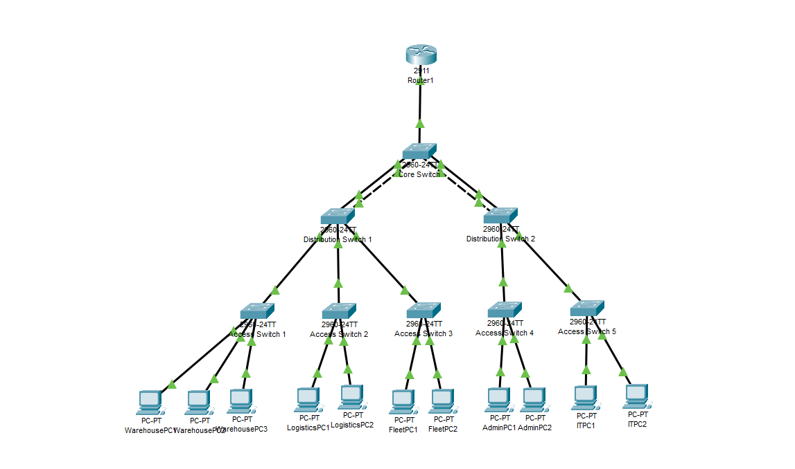

The network follows Cisco's three-layer hierarchical architecture consisting of:

- Edge Router
- Core Switch
- Distribution Switches
- Access Switches

This design improves scalability, simplifies management, and provides redundancy between network layers.

---

# Technologies Used

- Cisco Packet Tracer
- Cisco IOS
- VLANs
- VLSM
- Router-on-a-Stick
- DHCP
- EtherChannel (LACP)
- Rapid PVST+
- Port Security
- SSH
- ACLs

---

# Network Features

## VLAN Segmentation

Separate VLANs were created for each department to reduce broadcast traffic and improve network security.

| VLAN | Department |
|------|------------|
|10|Warehouse|
|20|Logistics|
|30|Fleet|
|40|Administration|
|50|IT|
|99|Management|

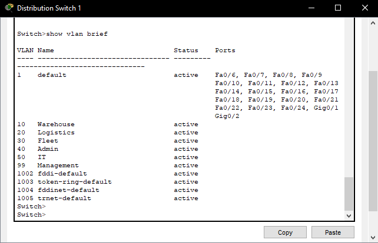

---

## Trunk Links

802.1Q trunk links allow VLAN traffic to pass between switches while maintaining network segmentation.

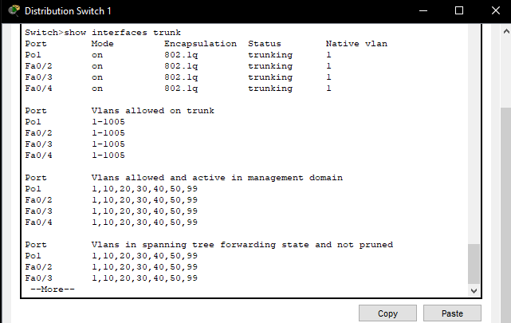

---

## EtherChannel

LACP EtherChannel was configured between the Core and Distribution switches to provide:

- Increased bandwidth
- Link redundancy
- Fault tolerance

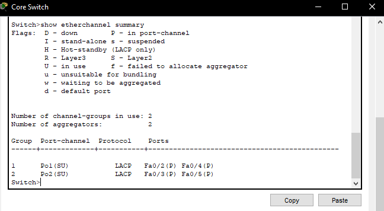

---

## Inter-VLAN Routing

Router-on-a-Stick was implemented using router subinterfaces to enable communication between VLANs.

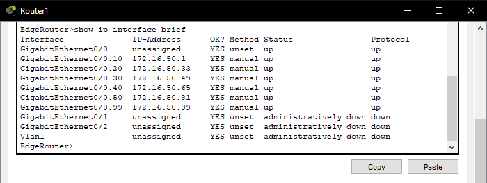

---

## DHCP

DHCP pools were configured for each VLAN, allowing clients to automatically obtain network configuration.

Router DHCP bindings:

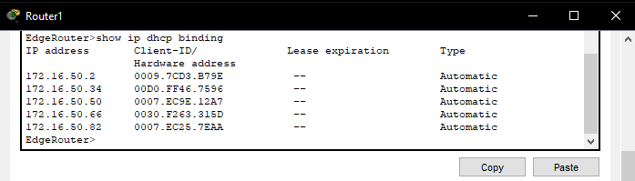

Client validation:

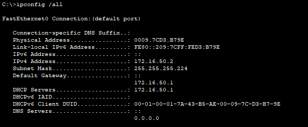

---

## Rapid Spanning Tree Protocol (RSTP)

Rapid PVST+ was configured across the switching infrastructure to prevent switching loops and improve convergence times.

Core Switch:

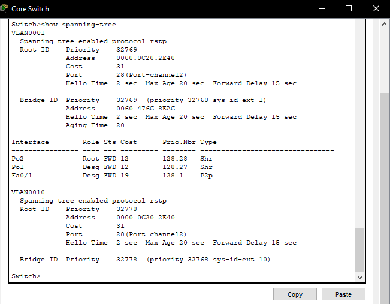

Distribution Switch:

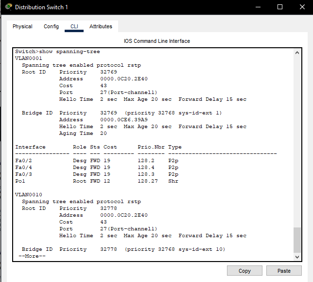

---

## Port Security

Port Security was configured on access switch ports to reduce the risk of unauthorized device connections.

Configured features include:

- Sticky MAC learning
- Maximum MAC addresses
- Restrict violation mode

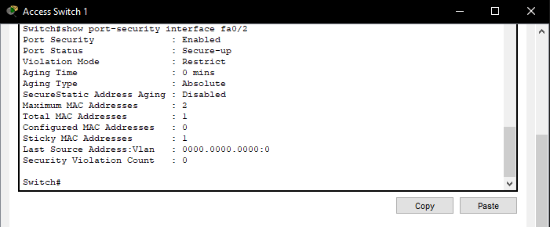

---

## Secure Remote Management

SSH Version 2 was configured for secure remote administration.

Security controls include:

- RSA key generation
- Local authentication
- SSH-only access
- ACL restrictions
- Management VLAN

Access Control List:

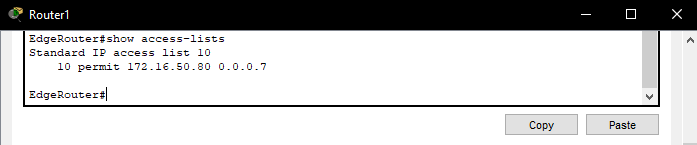

VTY Configuration:

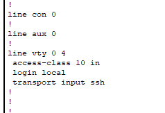

RSA Keys:

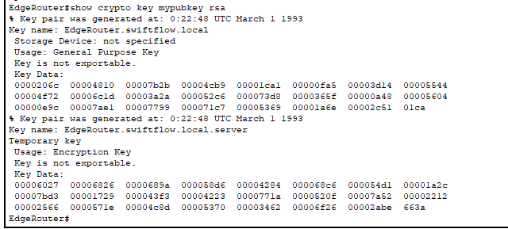

---

# Skills Demonstrated

- Enterprise Network Design
- Cisco IOS Configuration
- VLAN Configuration
- VLSM Address Planning
- Router-on-a-Stick
- DHCP Configuration
- Layer 2 Switching
- Layer 3 Routing
- EtherChannel (LACP)
- Rapid STP
- Port Security
- Secure Remote Management (SSH)
- Access Control Lists
- Network Validation and Testing

---

# Repository Structure

```
secure-enterprise-network-design/

├── packet-tracer/
│   └── secure-enterprise-network.pkt
│
├── screenshots/
│   ├── 01-network-topology.png
│   ├── ...
│
├── documentation/
│   └── technical-report.pdf
│
└── README.md
```

---

# Future Improvements

Potential enhancements include:

- OSPF dynamic routing
- HSRP gateway redundancy
- Network Access Control (NAC)
- Intrusion Detection System (IDS)
- Centralised Syslog server
- SNMP monitoring
- AAA authentication using RADIUS/TACACS+
